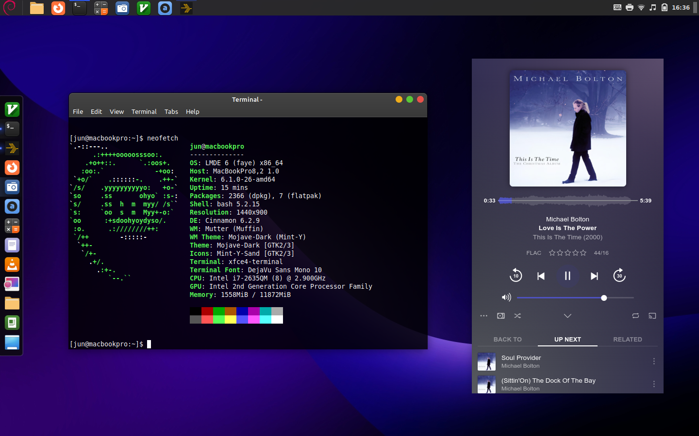
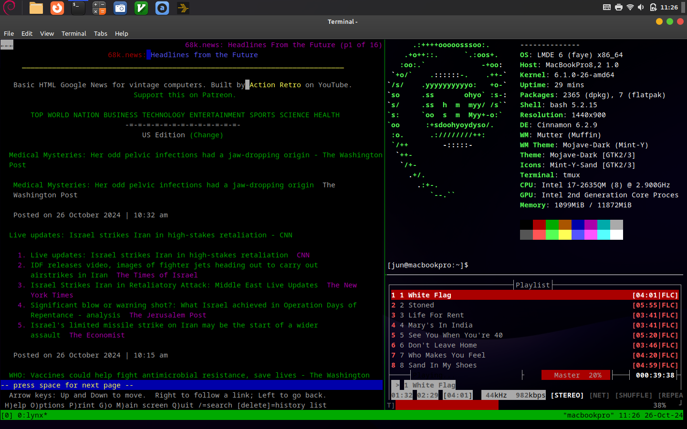

# LMDE 7 Install Notes

## Plexamp Not Playing
Downgrade to version 4.12.3
```
sudo flatpak update \
  --commit=$(flatpak remote-info --log flathub com.plexamp.Plexamp | grep -B1 -F 'to 4.12.3' | sed -e 's/^ \+Commit: \+//' -e 1q) \
  com.plexamp.Plexamp
```
and run this to prevent auto upgrade:
```
flatpak mask com.plexamp.Plexamp
```
Reference: [Does not start playback until audio device switched #270](https://github.com/flathub/com.plexamp.Plexamp/issues/270)

## 
## Macbook Air 2013 Specific (Hard Drive)

### During Boot
Presss "e", and add
```
intel_iommu=off 
```
to the linux line, the F10 to boot.

Do the same for the first boot before the following fix.

### Update /etc/default/grub 
```
GRUB_CMDLINE_LINUX="intel_iommu=off"
```
and then Update Grub 
```
sudo update-grub
```

## Post Install Tasks

### Remove packages
```
sudo apt remove libreoffice* thunderbird celluloid
```
### Install Packages
```
sudo apt install tmux mosh htop eog audacious rsync git jq lynx moc xfce4-terminal vim-gtk3 vlc plank
```
### Configuration Files
- [lynx](config/lynx_config)
- [moc](config/moc)
- [vnc](config/vnc)
- [vim](config/vim)

### Other Packages
 - [freetube(deb)](https://freetubeapp.io/#download)
 - [plexamp(flattub)](https://flathub.org/apps/details/com.plexamp.Plexamp)


## VNC
```
sudo apt install tigervnc-standalone-server
```
```
vncpasswd
```
```
vi ~/.vnc/xstartup
```
paste the following
```
#!/bin/bash
PATH=/usr/bin:/usr/sbin
unset SESSION_MANAGER
unset DBUS_SESSION_BUS_ADDRESS
exec cinnamon-session
```
then
```
chmod u+x ~/.vnc/xstartup
```
add alias to .bashrc
```
alias vnc='vncserver :1 -geometry 1920x1200  -localhost no'
```
Other commands
```
vncserver -list
```
```
vncserver -kill :1
```
## Macbook Pro 2011 Specific (Disable Faulty AMD dGPU)

### Update /etc/default/grub 
```
GRUB_DEFAULT=0
GRUB_TIMEOUT_STYLE=hidden
GRUB_TIMEOUT=0
GRUB_DISTRIBUTOR=`lsb_release -i -s 2> /dev/null || echo Debian`
GRUB_CMDLINE_LINUX_DEFAULT="quiet splash radeon.modeset=0 i915.lvds_channel_mode=2 i915.modeset=1"
GRUB_CMDLINE_LINUX=""
```

### Update /etc/grub.d/10_linux
```
echo "        outb 0x728 1" | sed "s/^/$submenu_indentation/"
echo "          outb 0x710 2" | sed "s/^/$submenu_indentation/"
echo "          outb 0x740 2" | sed "s/^/$submenu_indentation/"
echo "          outb 0x750 0" | sed "s/^/$submenu_indentation/"
echo "        insmod gzio" | sed "s/^/$submenu_indentation/"
```
### Update Grub 
```
sudo update-grub
```
### Validate dGPU is disabled
```
lspci -vnnn | grep VGA
```
## Sample Screenshots



## Resources
[LMDE 6 Download link](https://linuxmint.com/download_lmde.php)

